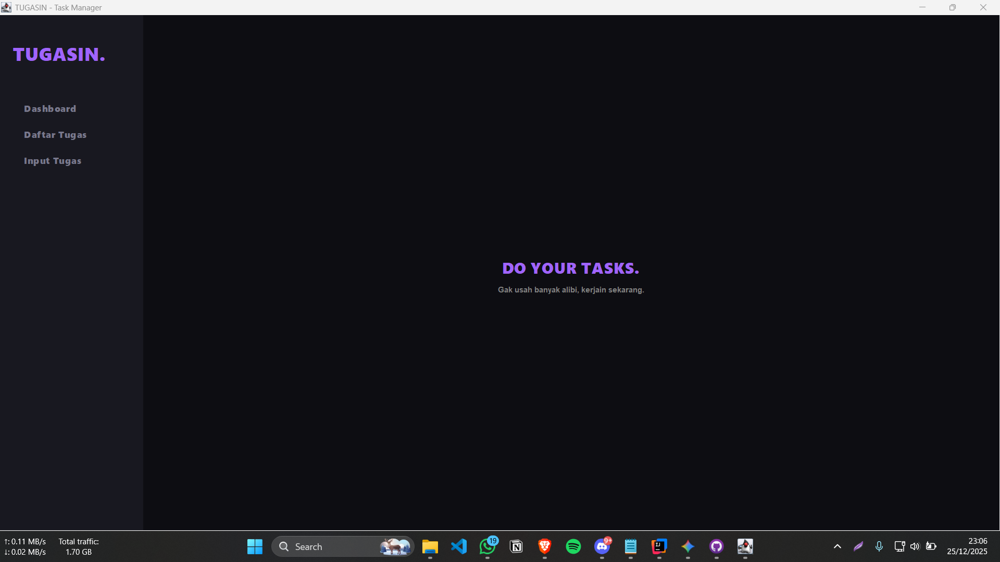
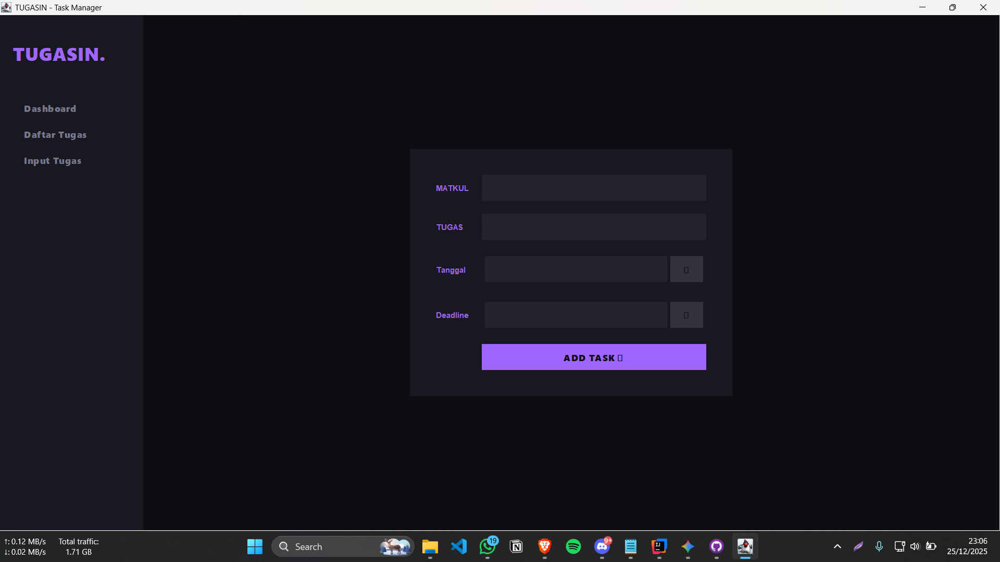
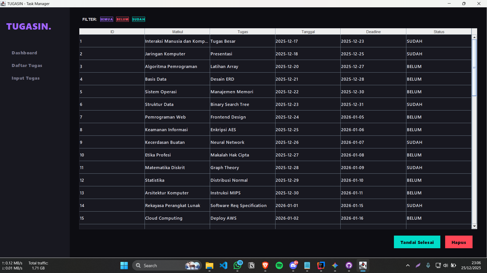

# 📝 TUGASIN - Task Manager Mahasiswa

**TUGASIN** adalah aplikasi manajemen tugas berbasis desktop yang dirancang khusus untuk mahasiswa guna memantau progres tugas kuliah dengan gaya visual yang modern (Gen Z Aesthetic). Aplikasi ini dibangun menggunakan **Java Swing** dengan arsitektur **Object-Oriented Programming (OOP)** yang terstruktur dan mengimplementasikan operasi **CRUD** lengkap dengan penyimpanan data permanen.

---

## ✨ Fitur Utama

- **Dashboard**: Tampilan awal yang memberikan motivasi untuk menyelesaikan tugas.
- **Manajemen Tugas (CRUD)**:
    - **Create**: Menambah tugas baru dengan ID otomatis.
    - **Read**: Menampilkan daftar tugas dalam tabel yang bersih.
    - **Update**: Menandai tugas yang sudah selesai langsung dari daftar.
    - **Delete**: Menghapus tugas yang sudah tidak diperlukan.
- **Sistem Filter**: Memisahkan tampilan tugas berdasarkan status: *Semua*, *Belum Selesai*, dan *Sudah Selesai*.
- **Visual Calendar Picker**: Input tanggal yang intuitif menggunakan dialog kalender visual (bukan input manual teks).
- **Persistensi Data**: Semua data tersimpan secara permanen dalam file `database_tugasin.txt`.
- **UI Aesthetic**: Desain antarmuka modern dengan skema warna yang nyaman dan tipografi *Segoe UI Black*.
- **Arsitektur OOP**: Kode terorganisir dengan prinsip Separation of Concerns untuk kemudahan maintenance.

---

## 🛠️ Teknologi yang Digunakan

- **Bahasa Pemrograman**: Java.
- **GUI Framework**: Java Swing & AWT.
- **Penyimpanan**: Flat File System (.txt).
- **Build Tool**: Maven.
- **Arsitektur**: Object-Oriented Programming (OOP).

---

## 📂 Struktur Proyek

```text
TUGASIN-Tugas_Integrator/
├── src/
│   └── main/
│       └── java/
│           └── org/example/
│               ├── Main.java               # Entry point & orchestrator aplikasi
│               ├── Task.java               # Model data untuk tugas
│               ├── TaskDatabase.java       # Database manager (CRUD operations)
│               ├── UIConstants.java        # Konstanta UI (warna & font)
│               ├── CalendarDialog.java     # Dialog kalender visual
│               ├── TaskListPanel.java      # Panel daftar tugas & filter
│               ├── TaskInputPanel.java     # Panel input tugas baru
│               ├── DashboardPanel.java     # Panel dashboard
│               ├── SidebarPanel.java       # Panel navigasi sidebar
│               ├── DataManager.java        # Helper untuk operasi file
│               └── UIUtils.java            # Helper untuk styling UI
├── database_tugasin.txt                    # File penyimpanan data tugas
├── pom.xml                                 # Konfigurasi Maven
└── README.md                               # Dokumentasi proyek
```

---

## 🏗️ Arsitektur Aplikasi

Aplikasi ini menggunakan **Object-Oriented Programming (OOP)** dengan pemisahan tanggung jawab yang jelas:

### 1. **Model Layer**
- `Task.java`: Representasi objek tugas dengan encapsulation lengkap.

### 2. **Data Access Layer**
- `TaskDatabase.java`: Mengelola operasi CRUD dan persistensi data ke file.
- `DataManager.java`: Helper untuk operasi file tingkat rendah.

### 3. **View Layer**
- `Main.java`: Entry point & orchestrator utama.
- `TaskListPanel.java`: UI untuk menampilkan dan mengelola daftar tugas.
- `TaskInputPanel.java`: UI untuk menambahkan tugas baru.
- `DashboardPanel.java`: UI halaman dashboard.
- `SidebarPanel.java`: UI navigasi sidebar.
- `CalendarDialog.java`: UI dialog pemilihan tanggal.

### 4. **Utility Layer**
- `UIConstants.java`: Menyimpan konstanta warna dan font.
- `UIUtils.java`: Helper untuk styling komponen UI.

---

## 🎨 Prinsip OOP yang Diterapkan

1. **Encapsulation**: Setiap class memiliki data dan method yang terkait, dengan access modifier yang tepat.
2. **Separation of Concerns**: Setiap class memiliki satu tanggung jawab yang jelas (Single Responsibility Principle).
3. **Modularity**: Kode terorganisir dalam modul-modul kecil yang mudah dipelihara dan di-test.
4. **Reusability**: Komponen UI dan utility dapat digunakan kembali dengan mudah.

---

## 🚀 Cara Menjalankan

### Prerequisites
- **Java Development Kit (JDK)** 8 atau lebih tinggi.
- **Maven** (opsional, untuk build management).

### Langkah-langkah
1. Clone repository:
   ```bash
   git clone https://github.com/username/TUGASIN-Tugas_Integrator.git
   cd TUGASIN-Tugas_Integrator
   ```

2. Compile dan jalankan:
   ```bash
   # Menggunakan Maven
   mvn clean compile
   mvn exec:java -Dexec.mainClass="org.example.Main"
   
   # Atau langsung dengan javac
   javac -d bin src/main/java/org/example/*.java
   java -cp bin org.example.Main
   ```

3. Aplikasi akan terbuka dan file `database_tugasin.txt` akan dibuat secara otomatis.

---

## 📊 Format Data

Data disimpan dalam file `database_tugasin.txt` dengan format:
```
ID|Matkul|Tugas|TanggalDiberikan|Deadline|Status
```

Contoh:
```
1|Pemrograman Java|Tugas OOP|2024-01-15|2024-01-22|BELUM
2|Basis Data|Desain ERD|2024-01-16|2024-01-23|SUDAH
```

---

## 📸 Screenshot

### Dashboard


### Input Tugas


### Daftar Tugas


---

## 🤝 Kontribusi

Kontribusi selalu diterima! Silakan fork repository ini dan submit pull request untuk perbaikan atau penambahan fitur.

---

## 📄 Lisensi

Proyek ini menggunakan lisensi MIT. Silakan lihat file `LICENSE` untuk detail lebih lanjut.

---

## 👨‍💻 Author

Dibuat dengan ❤️ oleh mahasiswa yang paham perjuangan deadline tugas kuliah.

**TUGASIN** - *Do Your Tasks. No Excuses.*
